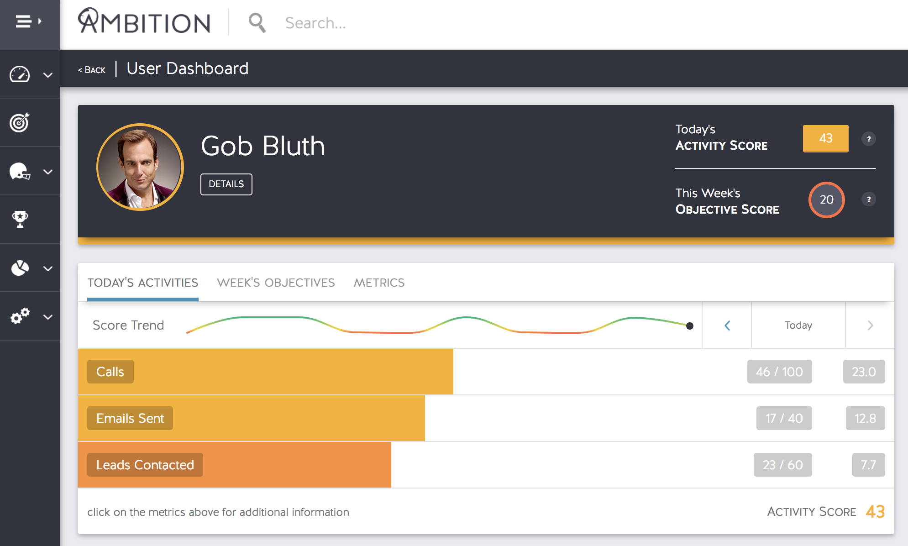

# Send Daily User Close.io Activity Reports to Ambition

For questions about this script, email [nick@close.io](mailto:nick@close.io).

### What the script does
1. Retrieves a list of all your active Close.io users.
2. Generates a daily Activity Report and demo-related activity for each Close.io users.
3. Wraps the activity data into an Ambition data format
4. Sends the  to an Ambition endpoint.

### IMPORTANT: Preparing Ambition to accept the data from Close.io

Read and review the [Checklist and Setup instructions in Ambition's API documentation](https://help.ambition.com/v1.0/docs/api-setup). You MUST set up the following Data Format in Ambition before running this script:

| Field Key                    | Display Name                 | Field Type            |
|:----------------------------:|:----------------------------:|:---------------------:|
| email                        | Email                        | Email Address         |
| date                         | Date                         | Date                  |
| leads_contacted              | Leads Contacted              | Metric (Sum)          |
| emails_sent                  | Emails Sent                  | Metric (Sum)          |
| emails_received              | Emails Received              | Metric (Sum)          |
| call_duration                | Call Duration                | Duration Metric (Sum) |
| call_duration_avg            | Call Duration Avg            | Duration Metric (Sum) |
| sms_sent                     | SMS Sent                     | Metric (Sum)          |
| sms_received                 | SMS Received                 | Metric (Sum)          |
| opportunities_created        | Opportunities Created        | Metric (Sum)          |
| revenue_created_one_time     | Revenue Created (One Time)   | Metric (Sum)          |
| revenue_created_monthly      | Revenue Created (Monthly)    | Metric (Sum)          |
| revenue_created_annual       | Revenue Created (Annual)     | Metric (Sum)          |
| opportunities_lost           | Opportunities Lost           | Metric (Sum)          |
| revenue_lost_one_time        | Revenue Lost (One Time)      | Metric (Sum)          |
| revenue_lost_monthly         | Revenue Lost (Monthly)       | Metric (Sum)          |
| revenue_lost_annual          | Revenue Lost (Annual)        | Metric (Sum)          |
| revenue_won_one_time         | Revenue Won (One Time)       | Metric (Sum)          |
| revenue_won_monthly          | Revenue Won (Monthly)        | Metric (Sum)          |
| revenue_won_annual           | Revenue Won (Annual)         | Metric (Sum)          |
| opportunities_won            | Opportunities Won            | Metric (Sum)          |
| demos_scheduled              | Demos Scheduled              | Metric (Sum)          |
| demos_rescheduled            | Demos Rescheduled            | Metric (Sum)          |
| demos_held                   | Demos Held                   | Metric (Sum)          |
| total_demos_scheduled        | Total Demos Scheduled        | Metric (Sum)          |
| demos_conducted              | Demos Conducted              | Metric (Sum)          |

### What Close.io data is sent to Ambition

TBA

### Running the script locally

1. Clone this repo.
1. Navigate to the folder in Terminal: `cd closeio-to-ambition`
1. Intiate a new environment with virtualenv: `virtualenv venv`
1. Activate the virtual environment: `source venv/bin/activate`
1. Install the script's dependencies with pip: `pip install -r requirements.txt`
1. Open the `_credentials.py` file, add your Close.io API Key, Close.io Organization ID, Ambition Endpoint URL, and Ambition auth token.
1. Run the script, adding an argument for how many days you'd like to go into the past. Here's an example for running the activity report for today and yesterday: `python send_closeio_activity_report_to_ambition.py 1`

### Running the script automatically as a cron job

- Today's report, every hour: `* */1 * * * python send_closeio_activity_report_to_ambition.py 1`
- Yesterday and today's report, every 6 hours: `* */6 * * * python send_closeio_activity_report_to_ambition.py 1`
- Yesterday and today's report, at 9PM local server time: `* 20 * * * python send_closeio_activity_report_to_ambition.py 1`
